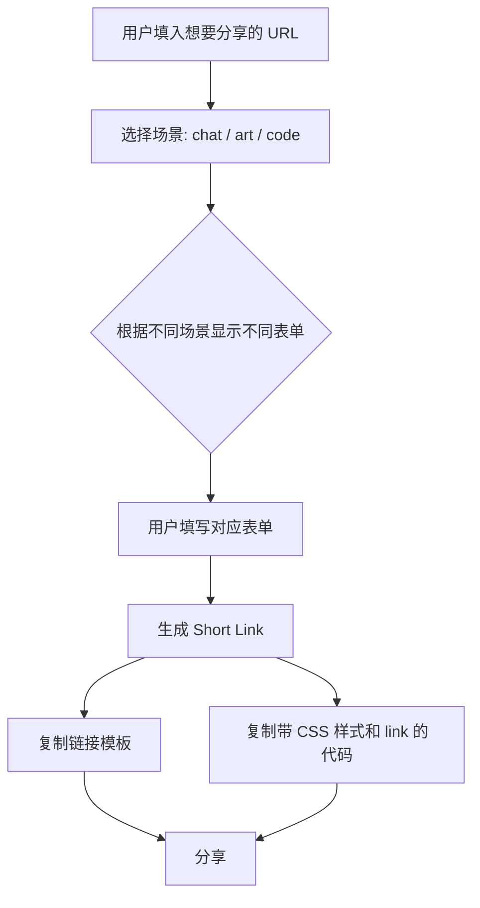
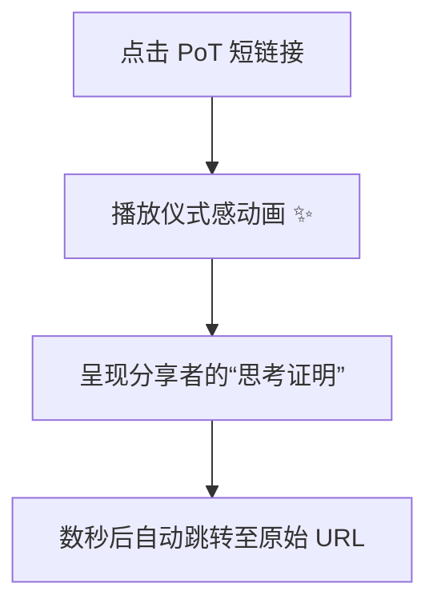

# Proof of Thought (PoT)

> 在 AI 时代，为你的分享盖上一个“人类思考”的印章。

## Inspiration

在一个 AI 可以高效生成文本、代码甚至艺术的时代，我们开始面临一个新的社交难题：直接甩给别人一长串未经思考和整理的 AI 生成内容，是一种不尊重的行为。这不仅将筛选和验证的认知负担转移给了接收者，也消解了分享背后本应有的人类智慧与情感。

本次黑客松的主题是 **“何以为人”**，探讨那些无法被代码复制的人类特质——创造力、同理心、道德判断和面对不确定性的勇气。

这让我们思考：我们该如何在一个由算法驱动的世界里，保留并彰显“人”的价值？**Proof of Thought (PoT)** 正是我们的答案。我们认为，人的价值不在于“比机器更快更强”，而在于我们是“意义的编织者”。PoT 旨在将分享 AI 辅助内容的过程，变成一种有仪式感的、彰显人类思考价值的行为。

## What is PoT?

**Proof of Thought (PoT)** 是一个开源工具，它能帮助你为任何你想分享的、经过 AI 辅助创作的内容，附加一份“思考证明”。

它通过一个引导式的表单，让你记录下在使用 AI 过程中的**灵感来源、思考路径、关键决策和修改痕迹**。然后，PoT 会生成一个专属的短链接。当他人打开这个链接时，看到的不再是冷冰冰的最终结果，而是一段酷炫的动画，以及你那份独一无二的“思考证明”。

我们希望通过这种方式，推广一种更负责任、更具人文关怀的 AI Manners（AI 时代的新礼仪），并让每一次分享都成为对“何以为人”的有力注脚。

## Features

  * **场景化思考表单**：根据你分享的内容是 `对话(Chat)`、`艺术(Art)` 还是 `代码(Code)`，提供不同的引导式问题，帮助你快速梳理思路。
  * **仪式感动画**：在展示“思考证明”前，播放一段精心设计的动画，创造独特的“开箱”体验。
  * **PoT 印章**：为你的 GitHub MarkDown 提供“PoT 印章”（Badge），可以嵌入到你的博客、PR 中，直观地展示这份内容背后有人类的深度思考
  

  
  

  
  * **模板化分享**：一键复制优雅的分享文案和带有 PoT 链接的 Markdown 代码，方便地分享到任何地方。

## How It Works

### 流程一：创建你的 PoT 链接

### 流程二：查看他人的 PoT

## The PoT Stamp

“PoT 印章”是你思考的浓缩凭证。你可以把它嵌入到任何支持 Markdown 的地方。它不仅仅是一个链接，更是一种宣言：

**“这份内容，我思考过，我为此负责。”**

## Our Vision

AI 是强大的工具，但不应成为我们思考的替代品。

在“何以为人”的追问下，PoT 尝试从一个微小的切入点——“分享”——来重塑我们与技术的关系。我们相信，当每一次分享都附带着一份真诚的“Proof of Thought”，我们便是在用行动证明：

人类的价值，在于为冰冷的宇宙注入温度，用必死的肉身书写永恒的故事。而你的创造，正是对“何以为人”最好的回答。
